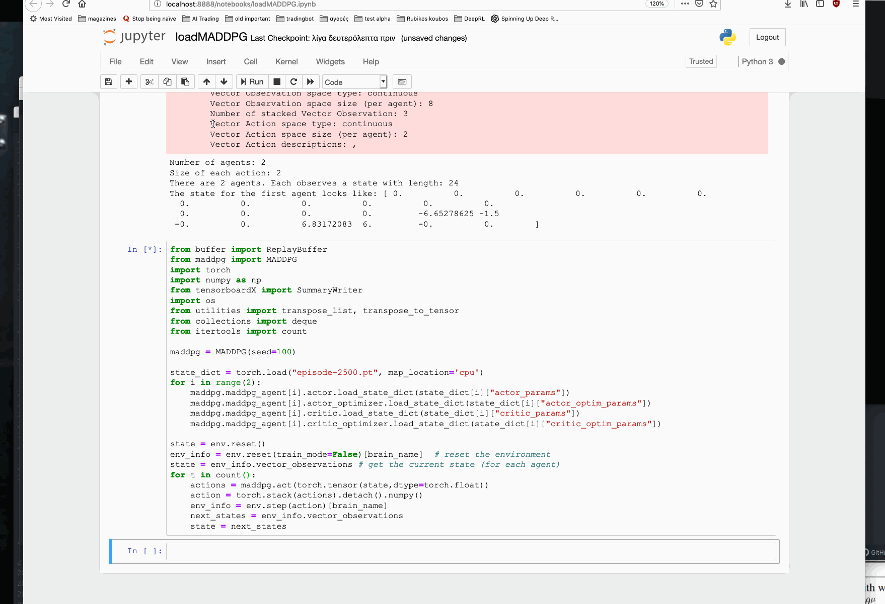

## Report

### Introduction

The purpose of this project is to solve the Tennis multi-agent environment using Deep Reinforcement Learning.
To do this I used a modification of the established DDPG algorithm adapted for the multi-agent environment (MADDPG).

The DPPG algorithm is summarized in the following:

DDPG is an actor-critic policy gradient method. It uses two types networks an Actor network and a critic network. The role of the Actor network is to select which actions to take next and for the critic (as the name suggests) is to improve on the "acted" policy. At each step we update the actor policy using the critic network. So, we're using the critic network as constructing criticism to the actor policy.

## The multi-agent algorithm

In the tennis environment we have two agents each with their own actor and critic networks (target and local). The original algorithm can be extended to N-agents as you can see above of course. For each episode we sample actions for both agents and improve their actor and critic networks. Each one tries to maximize it's own, by they end up serve the same purpose.

As you can see it's not that different from the one-agent DDPG. However, the implementation is significantly harder since at each point we have to handle two sets of states and actions.

## Installation

To run the project install the dependencies from Udacity. https://github.com/udacity/deep-reinforcement-learning:

* create a new conda environment
* git clone the repository
* cd into folder
* `pip install -e .`

Also you can find the unity environment to run the project from here: https://github.com/spirosrap/collab-compet or https://github.com/udacity/deep-reinforcement-learning/tree/master/p3_collab-compet.

## Hyperparameters

* number_of_episodes = 3000
* max_episode_length = 1000
* batchsize = 128
* noise = 2
* noise_reduction = 0.9999
* Size of replay buffer 500000
* Learning rate of actor (both agents): 1.0e-4
* Learning rate of critic (both agents): 1.0e-3

## Chosen networks

The actor and critic networks are almost identical apart from the final layer. The critic outputs the dimension of the action.
I have used two versions but in my surprise the version with the lighter network (one less layer) performed better.

The better performed network uses three layers (`networkforall2.py`)  of size 512,256 and 64. Also, the first layer of each one is using batch normalization (1D).

## Plot of rewards

To calculate the average rewards I took the maximum reward from each agent after an episode ended.

The best average score over 100 episodes happend around the 2500 episode and it was about +1.77. Very close to the 2.5 benchmark.

## Ideas for Future Work

Since generally the PPO performs better than DDPG I would like to implement the multi-agent version. Also, experiment further with hyper-parameter tuning and network architectures and sizes.
